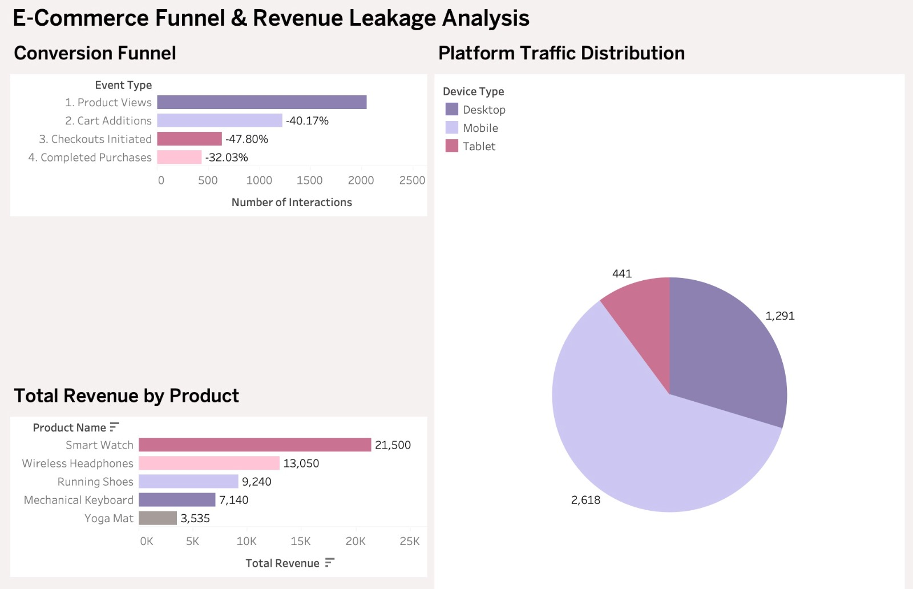

# 🛒 E-Commerce Funnel & Revenue Leakage Analysis

### Executive Summary
Built an end-to-end data pipeline to simulate, process, and analyze e-commerce user journeys. By generating realistic consumer traffic and tracking user events through a normalized SQL database, this project identifies a major drop-off point at the checkout stage and quantifies abandoned cart revenue leakage to drive actionable business interventions.

### 🛠 The Tech Stack
*   **Data Generation & Pipeline:** Python (`pandas`, `Faker`)
*   **Database & Analytics:** SQL (CTEs, Window Functions, Aggregations)
*   **Data Visualization:** Tableau 

---

### 📊 Interactive Dashboard
*(Note: I recommend downloading the `.twb` file below to view the interactive dashboard and inspect the underlying calculated fields.)*



*👉 **Technical Reviewers:** [Download the Tableau Packaged Workbook](dashboard/workbook.twb) to interact with the dashboard and inspect the underlying data, calculations, and joins.*

---

### 💡 Key Business Insights
Based on the funnel analysis of 1,000 simulated users across desktop, mobile, and tablet devices:

1.  **Critical Checkout Drop-off:** The steepest decline in the user journey occurs at the checkout stage, with a **47.80% drop-off** between users initiating a checkout and actually completing the purchase.
2.  **High-Value Revenue Leakage:** The "Smart Watch" is the highest revenue-generating product ($21,500), but it also represents the highest potential revenue leakage if those specific items are abandoned in the cart.
3.  **Mobile Dominance:** Mobile devices account for the vast majority of platform traffic (over 60%), indicating that the mobile checkout experience must be heavily optimized.

### 🎯 Strategic Recommendations
To convert abandoned carts and recover lost revenue, the business should implement:
*   **Targeted Recovery Campaigns:** Trigger an automated, personalized email or push notification sequence within 1 hour for users who abandon high-ticket items (like the Smart Watch) at the checkout stage.
*   **Frictionless Mobile Checkout:** Given the high mobile traffic and steep checkout drop-off, audit the mobile UI/UX to implement one-click payment solutions (e.g., Apple Pay, Google Pay).

---

### 🏗 Architecture & Workflow

1.  **Simulation Pipeline (`mock_data_pipeline.py`):** Engineered a Python script utilizing `pandas` and the `Faker` library to generate realistic user demographics, product catalogs, and timestamped behavioral events (page views, cart additions, checkouts, and purchases).
2.  **Data Modeling & Transformation (`E-Commerce Funnel.sql`):** Designed a normalized relational schema for Users, Products, and Events. Wrote advanced SQL queries utilizing Common Table Expressions (CTEs) and `LAG()` Window Functions to calculate step-by-step conversion rates and isolate missed sales.
3.  **Visualization (`dashboard/`):** Connected the simulated data to Tableau to build an executive-facing dashboard focusing on funnel friction and revenue impact.

#### Data Model (Entity-Relationship Diagram)

```mermaid
erDiagram
    USERS ||--o{ EVENTS : "performs"
    PRODUCTS ||--o{ EVENTS : "is_part_of"

    USERS {
        INT user_id PK
        DATE signup_date
        VARCHAR(50) device_type
    }

    PRODUCTS {
        INT product_id PK
        VARCHAR(100) product_name
        VARCHAR(50) category
        DECIMAL price
    }

    EVENTS {
        INT event_id PK
        INT user_id FK
        INT product_id FK
        TIMESTAMP event_time
        VARCHAR(50) event_type
    }


